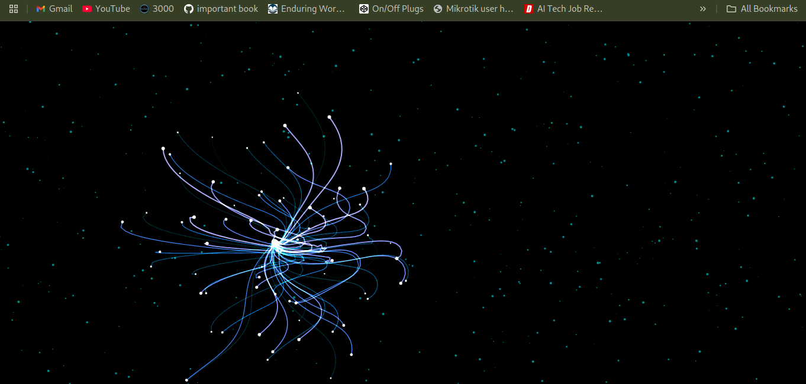

# Tentacles

Beautiful, animated tentacles created with **HTML**, **CSS**, and **JavaScript**. These tentacles gracefully follow your mouse cursor and display autonomous, lifelike movement when the cursor is not present.



## Demo

Open `tentacles.html` in any modern browser to see it in action.

## Features

- Real-time canvas animation
- Responsive to mouse movement
- Autonomous animation when idle
- Pure JavaScript, no dependencies

## Usage

Clone the repository and open `tentacles.html` in your browser:

```bash
git clone https://github.com/yourusername/tentacles.git
cd tentacles
open tentacles.html  # or use your preferred method to open it
